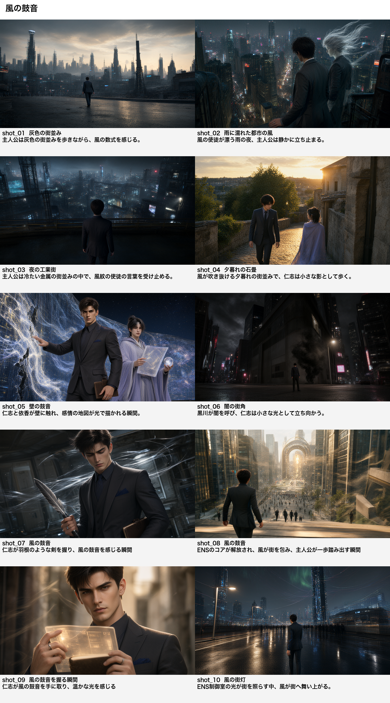

# 完全版作例

簡易版の作例は削除し、Colab版相当の全工程を実行した完全版作例を3件置いています。

| 作例 | タイトル | モデル | 所要時間 |
|---|---|---|---:|
| [full-gemma4-e4b](batch_full-gemma4-e4b/) | [ノイズの共鳴図鑑](batch_full-gemma4-e4b/run_001/20260828_200154_ノイズの共鳴図鑑.md) | `gemma4:e4b` | 約30分15秒 |
| [full-qwen3.8-27b](batch_full-qwen3.8-27b/) | [欠落した共鳴](batch_full-qwen3.8-27b/run_001/20260829_021650_欠落した共鳴.md) | `qwen3.8:27b` | 約60分15秒 |
| [full-gpt-oss-20b](batch_full-gpt-oss-20b/) | [風の鼓音](batch_full-gpt-oss-20b/run_001/20260829_035433_風の鼓音.md) | `gpt-oss:20b` | 約33分48秒 |

## 含まれる成果物

- ナラティブ分析
- 要素プールとプロット形式分類
- 世界観設定
- キャラクター4人
- プロット骨子A〜E
- 12段階ヒーローズ・ジャーニー
- 10章の本文
- タイトル
- キャラクター別ビジュアルプロンプト
- 生成メタデータと重複判定用フィンガープリント
- 章ごとのチェックポイントと途中再開設定

## 生成設定

```text
loops: 1
pool_size: 3
journey_stage_count: 12
chapter_count: 10
world: enabled
plot_skeleton: enabled
visual_prompts: enabled
max_chapter_continuations: 2
```

`pool_size` は探索候補数であり、物語本編の工程や章数には影響しません。
所要時間はこのマシンでの実測値で、モデルのロード状態や負荷によって変動します。

モデルごとの実行設定は次のとおりです。

- `gemma4:e4b`: `num_ctx=8192`、標準のテキスト出力上限
- `qwen3.8:27b`: `num_ctx=8192`、標準のテキスト出力上限
- `gpt-oss:20b`: `num_ctx=16384`、推論モデル向けの出力枠。JSONモード非対応時の互換処理と、空本文時の有限リトライを有効化

gpt-oss作例の所要時間は、本文生成後にビジュアルプロンプト工程だけを途中再開した時間を含みます。

## ストーリーボード作例

[風の鼓音](batch_full-gpt-oss-20b/run_001/storyboard/storyboard.md) について、`render_storyboard.py` で生成したストーリーボードを
[`batch_full-gpt-oss-20b/run_001/storyboard/`](batch_full-gpt-oss-20b/run_001/storyboard/) に置いています。



- コマ数: 10（1章=1コマ）
- ショットサイズ: 段階から割り当て（大ロング3、ロング3、全身1、ミディアム1、クローズアップ2）。大ロング・ロングは環境を主語にした場面指示で生成
- ショットリスト: `gpt-oss:20b`
- 画像: `qwen-image-2.1-turbo`（Qwen-Image 2.1 + Viggle 6ステップLoRA）、720×400、`--seed 42`
- キャラクター参照: 既定の `closeup`（ミディアムとクローズアップの3コマだけ参照画像を使用。参照画像は `storyboard/characters/`）
- 1コマの生成時間: 参照なし約39〜82秒、参照あり約124〜153秒（この回の実測。マシンの状態で変動します）
- 実行環境: M4 Max、ComfyUI v0.37.4
- 画像モデルのライセンス: [Qwen Research License Agreement](https://huggingface.co/Qwen/Qwen-Image-2.1/blob/main/LICENSE)（利用目的は研究・評価に限られます）
