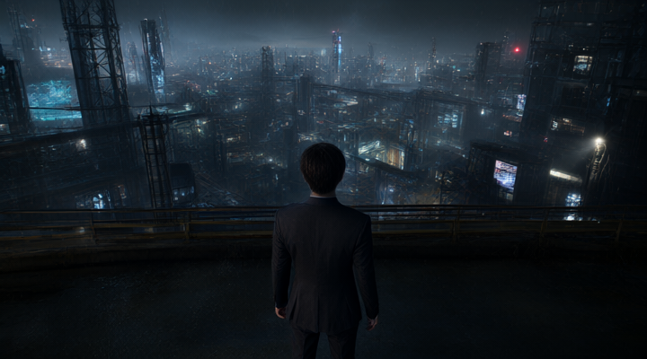
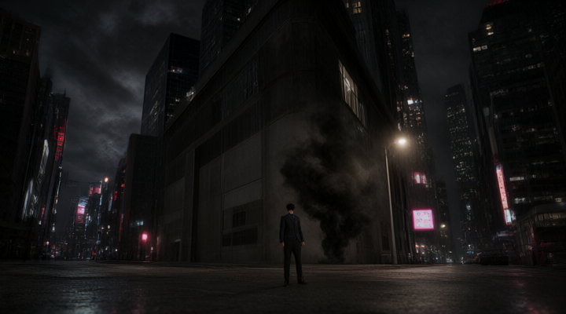

# 風の鼓音 — ストーリーボード

物語本文: [風の鼓音](20260829_035433_%E9%A2%A8%E3%81%AE%E9%BC%93%E9%9F%B3.md)　／　一覧画像: [storyboard_sheet.png](storyboard/storyboard_sheet.png)

`render_storyboard.py` で生成した、1章1コマ・全10コマのストーリーボードです。
各コマの引用は、その章の書き出しの段落です。

## 1. 第1章「風の数式」

**灰色の街並み** — 主人公は灰色の街並みを歩きながら、風の数式を感じる。

- 登場: 斎藤 仁志

> 斎藤仁志は、灰色に染まった町の路地を歩きながら、数値の音色を耳にしていた。朝の空気はデータの潮流で揺れ、足元に刻まれた「評価指数」――家族の生活は、その数値に従って分配され、感情は冷たいカウントに置き換えられていた。彼は通学路で、人々が掲げるカラフルな「幸福指数」を見守りつつ、自分の心は数え切れないほどにざらつく思いを抱えていた。

## 2. 第2章「風の囁きと影の呼び声」

**雨に濡れた都市の風** — 風の使徒が漂う雨の夜、主人公は静かに立ち止まる。

- 登場: 斎藤 仁志、風紋の使徒 カオル

> 夜風が鈍い灯りの影を揺らし、街の雑踏は薄紅色の霧のように溶けていた。斎藤仁志は、冷たいデータの波に飲み込まれた町を一歩先へ踏み出すつもりでいた。だが、心の奥底で湧く孤独と創造欲は、彼をさらなる高みへと呼んでいた。

## 3. 第3章「黙示の風を拒む心」

**夜の工業街** — 主人公は冷たい金属の街並みの中で、風紋の使徒の言葉を受け止める。

- 登場: 斎藤 仁志

> 夜の町並みは金属的な冷たさを帯びていた。斎藤仁志は、数値と線形方程式の残した痕跡を抱えた貧しい町の裏路地で、風紋の使徒カオルの言葉を静かに耳にしていた。カオルは、風の精のように薄い衣をまとい、目に浮かぶ虹色の光線で仁志を包み込んだ。「自らの心を信じ、相手の息を読む」と語るその声は、まるで砂漠の奥から響くさざ波のように柔らかく、しかし確かに震える音を宿していた。

## 4. 第4章「風が映す心の航路」

**夕暮れの石畳** — 風が吹き抜ける夕暮れの街並みで、仁志は小さな影として歩く。

- 登場: 斎藤 仁志、風間 依香（かざま いか）

> 夕暮れの町並みが金色に染まるころ、仁志は古い石畳の縁に身を沈めていた。彼の心は、かつての貧困と数値で測られた冷たい評価に閉ざされ、今もなお恐れの影を背負っていた。風が吹き抜けると、土の匂いと共に一枚の薄い羽毛が舞い上り、彼の肩に止まった。そこに立っていたのは、薄紫のローブをまとい、瞳に深い海を映す風間 依香だった。

## 5. 第5章「風の鼓音に揺れ、魂が綻びる瞬間」

**壁の鼓音** — 仁志と依香が壁に触れ、感情の地図が光で描かれる瞬間。

- 登場: 斎藤 仁志、風間 依香（かざま いか）

> 夜空に散る星の砂が、ENSのシリコンバレーの壁を照らす。黒川の冷たい影は遠くに消え、かつての貧しき町の風を背に、斎藤仁志と風間依香は静かに足を踏み入れた。二人の手は、風の鼓音を宿したデータの波紋を掴み、壁に触れると瞬間的に渦巻く感情の風景が映し出された。

## 6. 第6章「「風の試練と闇の影」」

**闇の街角** — 黒川が闇を呼び、仁志は小さな光として立ち向かう。

- 登場: 斎藤 仁志、黒川 織弥

> 闇に包まれた夜の街角で、黒川織弥は冷たい笑みを浮かべた。彼の手に握られた光るカードは、権力の紐解きの鍵――それでも仁志はそれを受け取ろうとしなかった。
「お前の心を、俺に貰う価値があるか？」黒川の声は風のように忍び寄り、仁志の胸に突き刺さった。
仁志は拳を握り締め、汗の匂いが彼の頬を濡らす。心の闇は、風の鼓音に揺れ、彼の魂を裂こうとしていた。

## 7. 第7章「影を抱く風の試練」

**風の鼓音** — 仁志が羽根のような剣を握り、風の鼓音を感じる瞬間

- 登場: 斎藤 仁志

> 暗い雲がENS制御室の窓を覆い、風はその裏へと消えていく。斎藤仁志は、手にしたカオルの羽根のような小剣を握り、静かな決意で深淵へ足を踏み入れた。心の壁が、金属の冷たさと混ざり合い、呼吸さえ止まるほどに緊張が走る。

## 8. 第8章「風の報酬 ― 心の雲を解き放つ瞬間」

**風の鼓音** — ENSのコアが解放され、風が街を包み、主人公が一歩踏み出す瞬間

- 登場: 斎藤 仁志

> 闇が薄れ、ENSの冷たい光がゆっくりと揺らめく。斎藤仁志は、風紋の使徒カオルの言葉を胸に、手を差し伸べた。指先に宿る風の震えは、まるで千の小鳥が囁くように、彼の内側を震わせた。そこに、風間依香の柔らかな笑顔が浮かび上げ、彼女の手から流れ出る夢幻構築の光が、沈黙の壁を滑らかに裂いた。

## 9. 第9章「風を紡ぐ帰還」

**風の鼓音を握る瞬間** — 仁志が風の鼓音を手に取り、温かな光を感じる

- 登場: 斎藤 仁志

> 月明かりが薄紅色に染めた町の路地で、仁志は足跡を残しながら帰路を歩んだ。データの海で失った自分を取り戻すために、彼はもう一度、故郷の風景を観察した。街角に咲く薄紫の花は、まるでENSのデータ解析で切り取られた数値の中に紛れ込んだ一瞬の詩のようだった。

## 10. 第10章「風の帰還 ― 町に落ちる感情の星」

**風の街灯** — ENS制御室の光が街を照らす中、風が街へ舞い上がる。

- 登場: 斎藤 仁志

> 夜の街灯が銀の光を放つ中、仁志は静かにENSの制御室へと足を踏み入れた。彼の肩には、風紋の使徒カオルが授けた「感情の風」が纏う軽やかな羽根のような器を抱えていた。
その器からは、微かな鼓動のような音色が漂い、街のデータネットワークを通り抜けては、無数の電波のざわめきと混ざり合う。
彼は制御パネルに手を滑らせ、深い呼吸を一つ。…

---

生成設定: ショットリスト `gpt-oss:20b`、画像 `qwen-image-2.1-turbo`（720×400、`--seed 42`）。詳細は [examples/README.md](../../README.md#ストーリーボード作例) を参照してください。
